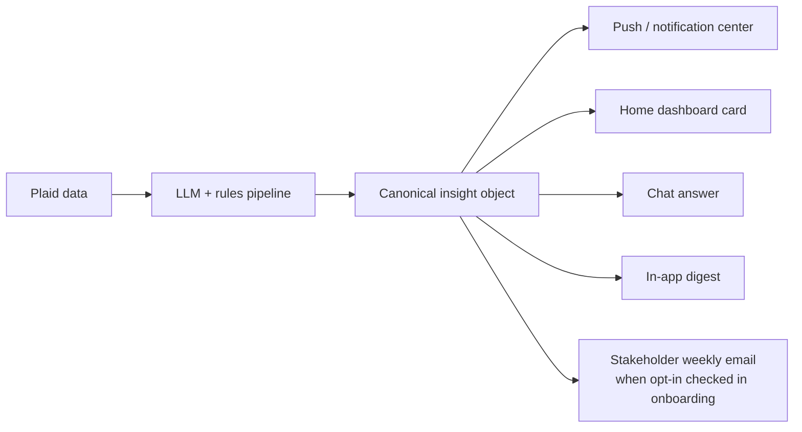
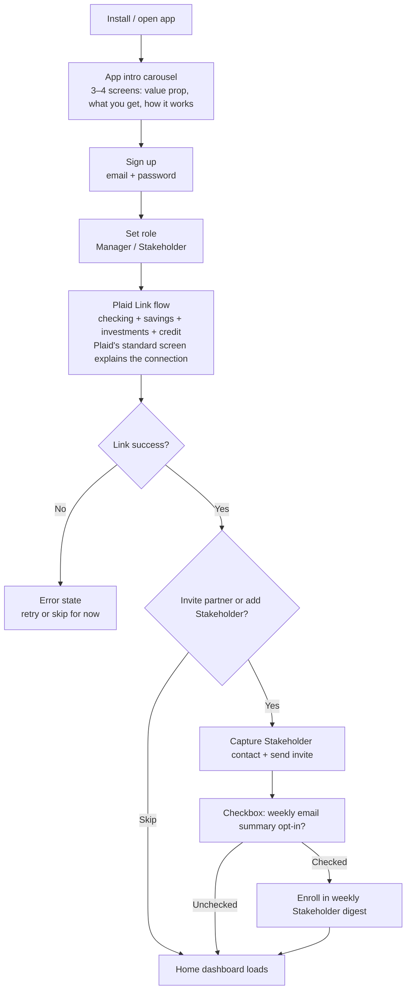
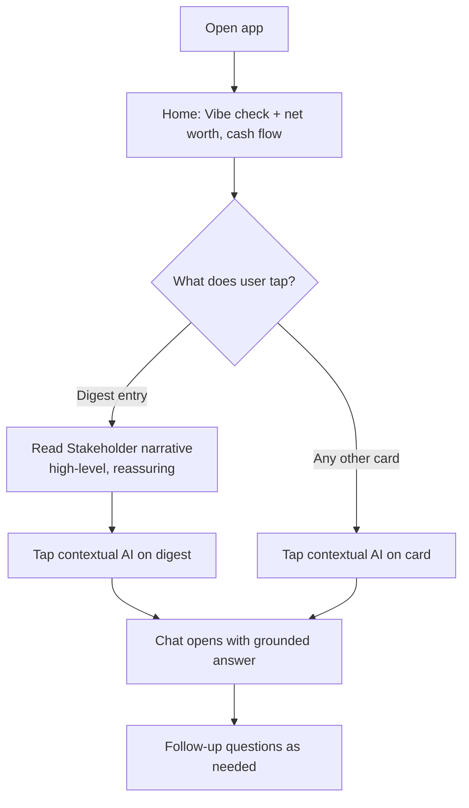
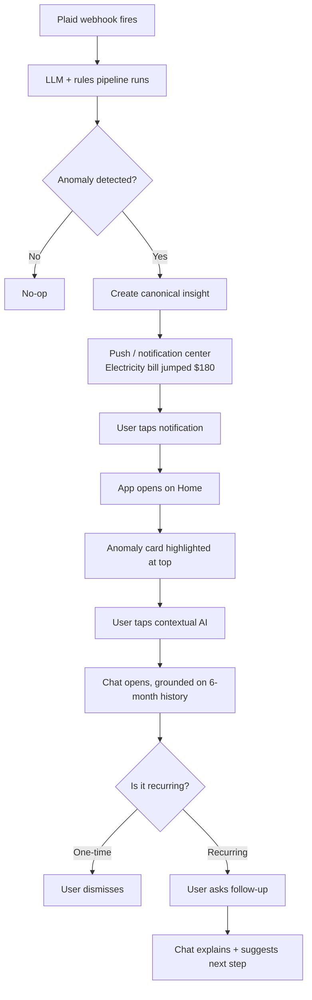
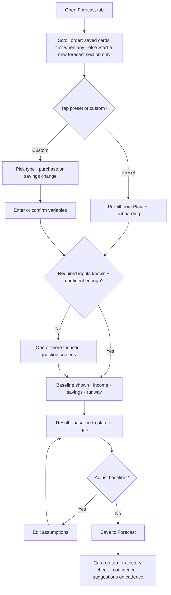
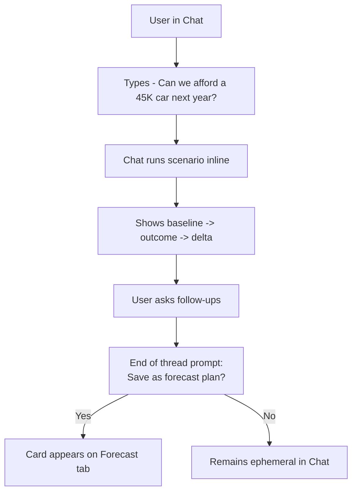
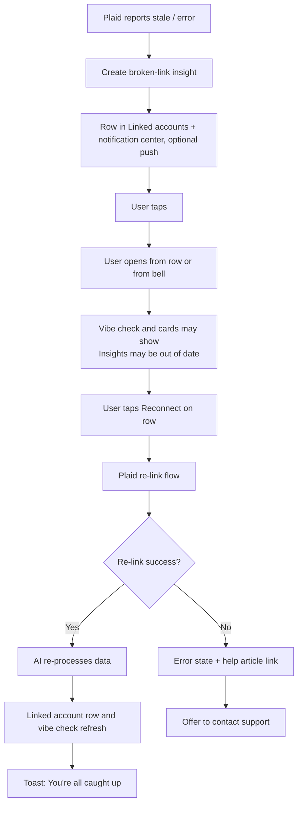

# Phoenix MVP — Scope, IA & User Journey

**Date:** 2026-04-21  
**Companion doc:** [2026-04-21-product-direction-and-mvp-scope.md](./2026-04-21-product-direction-and-mvp-scope.md)  
**Council review:** [2026-04-21-council-review-edge-cases.md](./2026-04-21-council-review-edge-cases.md)  
**Parent plan:** [Project Phoenix MVP Product Plan](./Project%20Phoenix%20MVP%20Product%20Plan.md)  
**Constraint:** Plaid is the only data source (Transactions, Liabilities, read-only Investments). No manual ledger entry. No money movement.

> **Note:** This document was reviewed by a 10-agent council on 2026-04-21. See companion council review for full edge case analysis. High-priority additions from that review are incorporated into the edge case sections below.

---

## 1. Target users


| Role                            | Profile                                                                                | Primary job                             |
| ------------------------------- | -------------------------------------------------------------------------------------- | --------------------------------------- |
| **The Manager** (primary)       | 35–45, high earner, financially literate, time-poor. Owns household financial picture. | "Am I on track without doing homework?" |
| **The Stakeholder** (secondary) | Partner who wants the big picture, not granularity.                                    | "Are we okay? Any surprises?"           |


Stage-3 "good enough" budgeters — care about **directionality and net worth growth**, not transaction detail.

---

## 2. MVP scope

### Phase 1 must-have

1. **Onboarding** — sign up, set role, Plaid link, baseline confirmation, optional partner invite
2. **Home dashboard** — vibe check, net worth (primary), cash flow direction (card face shows money in / money out / difference, with a last-few-months difference trend in expand; weekly savings averaged over the last four weeks as secondary context — not a standalone headline card), linked accounts (per-account last sync + health — replaces a separate Plaid banner), Investments card *(permanent; council-agreed)* — performance (user-pickable range, vs. broad-market index for context only; empty/link prompt if no brokerage) and payouts (rolling 12-month dividends/interest/payouts with % of typical monthly spend covered — passive-income proxy; empty when nothing qualifies), upcoming renewals card (conditional — surfaces known recurring charges in the next ~30 days; not a full subscription manager), anomaly card
3. **Forecast tab** — **preset life-event scenarios** (tap → **pre-fill** from onboarding/Plaid, then **targeted questions** when needed for a credible prediction) plus **unlimited saved scenario cards**; **Start a new forecast** groups **presets + custom**; once the user has saved cards, **saved cards** appear **above** that section; each card has its own **trajectory check** (on track / needs attention / ahead) with a **confidence** label, and **occasional suggestions** (get back on track, or go faster when already on track)
4. **Chat** — freeform Q&A grounded on Plaid snapshot; what-if save-as-forecast prompt
5. **Push / notification center** — in-app **notification center** is the **canonical list** of every open Plaid relink item and every **dismissible** home alert (see §3.4a); **push** remains a **high-bar subset** (e.g. broken Plaid, anomaly push deferred per council) — not the only place those insights exist
6. **Digest** — in-app **monthly** household narrative with both **Manager** and **Stakeholder** tone variants. The **Stakeholder in-app digest** is a first-class surface: accessible directly from the digest entry on Home and from a dedicated section in the app, so the Stakeholder can read it without relying on email. **Weekly email (optional):** when the Manager adds Stakeholder contact in onboarding, a **checkbox** offers to also send the same Stakeholder digest as a **weekly email** — same content, email delivery. **No** pre-checked box; unsubscribe in footer; Manager can toggle in Profile.
7. **Profile / account management** — manage connections (add/remove, full re-link; complements **Linked accounts** on Home), billing, support

> **Solo-first MVP:** The primary build target is the solo Manager experience in a read-only state. Partner invite, Stakeholder tone, and persona toggle are explicitly deferred to nice-to-have so we can make the solo experience as polished as possible before adding couple/persona complexity.

### Phase 1 nice-to-have

- Persona toggle (Manager ↔ Stakeholder) in Profile + app-wide tone switching
- Partner invite flow and Stakeholder web share-report
- **Home widget customization** — user-controlled reorder + show/hide for secondary widgets (cash flow, Investments card, digest entry). Core widgets (vibe check, net worth) remain locked. Deferred to Phase 2; widget component architecture should be laid in Phase 1 to support this.

### Out of scope (Phase 1)

- Full subscription **management** (list of every sub, categorization, cancel tools, negotiation) — Phase 2+. A **lightweight upcoming-renewals card** on Home is **in scope** (see Phase 1 must-have and §3.2 Home), scoped to "heads-up before it hits" only.
- Broad **Manager**-focused or marketing **email** programs (beyond the narrow exception below)
- Envelope / transaction-level budgeting
- Money movement, banking, brokerage trading, or new account opening
- Complex assets (crypto, real estate, private equity)
- **Deep actuarial retirement** (e.g. full decumulation, Social Security optimization) and **illiquid-asset modeling** (e.g. rental property) — Phase 2+; *common* life events ship as **presets** on Forecast in Phase 1

---

## 3. Information architecture

### 3.1 Nav structure

```
Bottom nav: Home | Forecast | Chat | Profile
```

No nav tab badges in v1 (Home refreshes too often to make a persistent badge meaningful; push carries urgency, cards carry ambient awareness).

### 3.2 Screen-by-screen content

**Home**

> **UX direction overlay:** Home is presented as a premium horizontally-swipeable deck of large, editorial insight cards (one card per question), not a vertically-scrolled widget stack. See [2026-04-23-home-swipeable-briefing.md](./2026-04-23-home-swipeable-briefing.md) for full visual direction, card anatomy, controls strip, motion, and open decisions. The content model, insight objects, and IA constraints in this section still govern; the briefing doc defines how those same reads are presented and navigated.

Home is organized around the urgency order of the "are we okay?" question. Each section starts with a summary signal the user can read without expanding. Numbers and detail are available on expand. Related reads are nested together so the user stops scanning as soon as they have what they need.

**Section order (top to bottom)**


| Section                                                                                                   | Collapsed summary                                                                               | Expand reveals                                                                     | Time period                                                                                                                                                         | Compared to                                                                                                                                                                                                                                  | Why it matters                                                                                                                                                                                                                                                      |
| --------------------------------------------------------------------------------------------------------- | ----------------------------------------------------------------------------------------------- | ---------------------------------------------------------------------------------- | ------------------------------------------------------------------------------------------------------------------------------------------------------------------- | -------------------------------------------------------------------------------------------------------------------------------------------------------------------------------------------------------------------------------------------- | ------------------------------------------------------------------------------------------------------------------------------------------------------------------------------------------------------------------------------------------------------------------- |
| **1. Status — vibe check** *"Is anything on fire right now?"*                                             | Vibe check label (On track / Ahead / Needs attention) + one active alert if any, or "All clear" | What drove the label; anomaly detail + dismiss                                     | Recent money-in and money-out patterns from linked accounts. Shows Preliminary until enough history exists.                                                         | The income and spending picture confirmed at baseline; app refines over time.                                                                                                                                                                | One plain label for "does our money life look okay right now?" Anomaly (if active) nests here — same urgency read, not a separate card.                                                                                                                             |
| **2a. Financial picture — net worth** *"Are we moving in the right direction?"*                           | Net worth figure + delta (e.g. up $4,200 this month)                                            | Net worth by All / Assets / Liabilities with account rows                          | Snapshot as of last successful bank and broker sync. Delta shown vs. prior month by default; period-selectable (month / quarter / year).                            | Not a comparison to other people. All / Assets / Liabilities splits what you own vs. what you owe; each account row shows sync health.                                                                                                       | "Where do we stand?" — balances and direction, not advice. Broken or stale link: tap row to reconnect; full add/remove in Profile.                                                                                                                                  |
| **2b. Financial picture — cash flow** *"Are we moving in the right direction?"*                           | One-line cash flow signal (e.g. "Saving ~$X/week")                                              | Full cash flow numbers (money in / money out / difference) + last-few-months trend | This month (labeled clearly). Secondary line: last four weeks averaged, so a late paycheck does not distort the read.                                               | What you likely earn vs. what actually left your accounts for spending, after inter-account transfers are excluded.                                                                                                                          | Collapsed: one-line savings signal. Expanded: three plain numbers (money in / money out / difference) + last-few-months trend of the difference.                                                                                                                    |
| **3. Investments** *(permanent)* *"How are our investments doing?"*                                       | Performance signal (e.g. up 6.2% YTD) + payouts coverage line                                   | Full performance chart vs. index · rolling-12-month payout breakdown               | Performance: user-pickable range (e.g. YTD, one year), as of last sync. Payouts: rolling last 12 months of dividends, interest, and other payouts, as of last sync. | Performance vs. a simple market index (e.g. S&P 500) for context only — not a target or recommendation. Payouts vs. your own monthly spend — plain line: "Your investment payouts this year would cover ~X% of a typical month of spending." | One read-only surface: portfolio move vs. the broad market and a simple passive-income proxy. No trades. If no brokerage is linked, the card invites you to link one; payouts empty when nothing qualifies; hide coverage ratio when spend baseline is Preliminary. |
| **4. Coming up — upcoming renewals** *(conditional — only when active)* *"Any surprises headed our way?"* | Count + top item (e.g. "2 renewals this month, one higher than last year")                      | Full upcoming-renewals list with last charge and delta                             | Next ~30 days of known recurring charges from transaction history.                                                                                                  | Last charge amount for the same merchant; flags price increases.                                                                                                                                                                             | Heads-up before it hits. Section hidden when no renewals are in the window. Tap-through opens contextual AI in Chat pre-grounded on that merchant — no cancel tools in MVP.                                                                                         |
| **5. Last month — digest entry** *"How did last month go overall?"*                                       | Digest entry — one-sentence narrative recap                                                     | Full in-app monthly digest                                                         | Last full calendar month (same window as the in-app monthly digest).                                                                                                | Prior month and typical patterns — a short narrative, not a second engine.                                                                                                                                                                   | Plain-language monthly recap. Stakeholder read lives inside the full digest.                                                                                                                                                                                        |


**Vibe check — extra touches (MVP):** one-time coach mark on first Home after onboarding; always-available contextual AI entry that opens Chat grounded on the vibe-check insight (what the label means and what data fed it); Preliminary when there is not enough history yet.

Every section includes a contextual AI entry into Chat — copy and pre-thread context explain that section's insight (what you're seeing, what drove it).

*Home composition principles:*

1. **Summary-first, expand for detail** — every section shows a scannable signal in collapsed state; numbers and breakdown are available on expand. The user should be able to answer their current urgency read without expanding anything they don't need.
2. **Nested reads, not flat cards** — sections that answer the same question (net worth + cash flow both answer "are we moving in the right direction?") are grouped together, not presented as equal-weight standalone cards.
3. **Stop when satisfied** — section order maps to urgency so the user can stop reading as soon as they have their answer. The Manager reading all sections is the exception, not the default.
4. **Max one active alert in Status** — if multiple anomalies exist, they batch into a single "N things to review" summary that expands in place. Never stack multiple alert banners.
5. **No competing directional stories** — if Status and Financial picture would show opposing sentiment from the same underlying data, the system reconciles them with an explanatory string before rendering both.
6. **Silence feels monitored** — when no alerts are active, Status shows a plain "All clear" confirmation. Per-account last synced visible within the Financial picture section's net worth rows is the main proof the system is watching.

**Notification center (in-app) — always mirrors relink + dismissible alerts**

**Entry point:** Bell icon in the **top nav bar** (top-right corner), present on every screen. Also reachable from Profile → Notification settings. Home stays curated (max one visible alert card) while the **in-app notification center** is the durable, always-accessible list for **actionable** relink and dismissible alerts (same objects as the net worth card account rows and Home cards).

- **Must appear in the notification center (same canonical insight object as Home account rows and linked-accounts list):**
  - **Plaid / connection relink** — every broken, stale, or action-required item (duplicates the row-level need for **Reconnect**; each institution or item is its own row with primary **Reconnect**; optional push for highest urgency per policy).
  - **Every conditional dismissible home alert** — every anomaly (or each item inside a batched "N things to review" group, depending on list UX) that can be dismissed or acknowledged on Home. Not a second logic path: **same object**, two surfaces.
- **Does *not* need to mirror by default** — the permanent Investments read-only card is present state, not a dismissible alert. Optional later: a low-noise "investment update" nudge in the list if we ever separate *informational* pushes from the alert stack; not required for v1.
- **Dismiss / acknowledge semantics (v1):** A single state per insight. Dismissing or acting from **Home** or from the **notification center** updates the same object so users never see a mismatch. If a row is removed from the list, it is also cleared from the Home alert zone (and vice versa after acknowledgement).
- **Sort / grouping** — Urgent system issues (relink) at top; anomalies next; **batch** multiple anomalies into one expandable entry or a compact group in the list so the center does not become a second wall of duplicate banners. Push remains the optional loud channel; the center is the **always available** in-app index.

**Forecast**

Forecast is where people answer **“am I on track for the things that matter?”** **Home** = how the **whole household** is doing *right now* (vibe check). **Forecast** = whether each **important plan** (down payment, college fund, sabbatical, car, etc.) is **on track, needs attention, or ahead** — with its own **confidence** when data is thin. Open Forecast from the **bottom nav**; Home does not add a second link.

**Mental model**

1. **Preset life events** — A row of **tappable** templates for goals almost everyone has (e.g. **emergency fund**, **home down payment**, **new car**, **sabbatical / time off**, **college** — the exact list = product + research). Tapping one opens the **same structured path** as a new scenario, with fields pre-chosen so people never start from a blank form. **It is not a one-tap instant prediction:** the app **pre-fills as much as possible** from **onboarding** and **Plaid-linked data** (baselines, balances, income signals). For an **accurate, well-calibrated** forecast, the flow may still present **one or more short screens** (individual questions) whenever something **required** is **missing, ambiguous, or not confident enough** from linked data alone. Only skip those steps when the engine already has sufficient inputs.
2. **Custom scenario** — **Start a custom forecast** for anything the engine supports in Phase 1 (at least **one-time purchase** and **savings- or allocation-style** changes). Same **pre-fill + follow-up question** rules as presets where applicable. Chat can pre-fill and **save to Forecast** from a thread.
3. **Many saved cards** — Each run you want to keep becomes a **saved scenario card** on this tab. There is no story-level limit on how many; each card is independent.
4. **Two levels of “vibe”** — **Home** = whole-household check. **Each saved card** = **trajectory check** for *that* goal only (on track / needs attention / ahead), with **Preliminary** or **low confidence** when we don’t yet have a steady read. They must **not** contradict each other without a one-line explainable reason (see Home principle #4).
5. **Suggestions** — **Inside** each card (or its detail), on a **light cadence** (e.g. after a meaningful **Refresh** or on a slow schedule — avoid nagging): if the trajectory is **needs attention** → concrete steps to get back on track; if **on track** or **ahead** → how to **speed up** or **lock in** the plan. Suggestions are grounded in the **engine output**; the model only words them (IA §6 #11).


| Screen area                                    | What it is                                                                                                                                                                                                                                                                                                                                                      |
| ---------------------------------------------- | --------------------------------------------------------------------------------------------------------------------------------------------------------------------------------------------------------------------------------------------------------------------------------------------------------------------------------------------------------------- |
| **Your saved scenarios**                       | When the user has **one or more** saved cards, this block appears **first** (below top nav). Scrollable **scenario analysis cards** — each shows latest numbers, **trajectory check** + **confidence**, **suggestions** affordance, **Data as of**, **Refresh / Edit / Delete**. Omitted on true first visit (no saved cards).                                  |
| **Start a new forecast** (one grouped section) | **Preset life events** and **Start a custom forecast** sit **in one section** (shared heading / container) on every Forecast visit: **first visit** (this section is the main body below top nav) and **after the user has saved cards** (this section sits **below** saved cards). Optional short hint, e.g. *Pick a common goal, or start a custom forecast.* |


| First visit / no saved cards yet   | After you have one or more saved cards                                          |
| ---------------------------------- | ------------------------------------------------------------------------------- |
| **Start a new forecast** (section) | **Your saved scenario cards** first (trajectory check, confidence, suggestions) |
| · **Preset life events**           | **Start a new forecast** (section)                                              |
| · **Start a custom forecast** CTA  | · **Preset life events**                                                        |
| Short hint under the section       | · **Start a custom forecast** CTA                                               |
|                                    | Optional short hint so starting another plan stays obvious                      |


*Each saved card — what to show (plain language)*


|                                                        | Time / freshness                                                                                        | Compared to                                                                                 | Why it helps                                                                                                                                                                                                                                             |
| ------------------------------------------------------ | ------------------------------------------------------------------------------------------------------- | ------------------------------------------------------------------------------------------- | -------------------------------------------------------------------------------------------------------------------------------------------------------------------------------------------------------------------------------------------------------- |
| **Life impact summary** *(major milestone cards only)* | Rendered at top of card on every Refresh; suppressed or simplified on routine cards.                    | Synthesizes deterministic engine outputs into a plain consequence — never invents a number. | The human stakes first, not a raw number: *“Buying this house means ~$900/month less in discretionary spending for the next 5 years.”* LLM writes this line from engine outputs only (IA §6 #29).                                                        |
| **Numbers**                                            | **Last updated** on **Refresh**; stamp **Data as of** with last sync.                                   | **Today’s baseline** vs. the **target** you set (amount, date, funding path).               | You always see **where you are → with this plan → the gap** — never a floating “result” with no **before** (IA §6 #1).                                                                                                                                   |
| **Forward timeline**                                   | Same freshness as trajectory check.                                                                     | Today’s position → projected path → goal date on the same axis.                             | Visual arc from now to goal — makes the trajectory label intuitive rather than abstract. Collapsed: compact sparkline showing direction. Expanded: full chart with sensitivity band from the stress cases (see Recommendation #1).                       |
| **Trajectory check** (this card only)                  | Recomputed on Refresh; can show **Preliminary** when history is short.                                  | The **goal you named** and its plan — *not* mixed with other goals.                         | Answers **“is this one goal on track?”** without reading every other plan.                                                                                                                                                                               |
| **Readiness date**                                     | Recomputed on Refresh; shows **Preliminary** until baseline is sufficient.                              | Current trajectory → goal target → estimated arrival.                                       | Answers **“when would I be ready?”** — a concrete date (or range) is often more actionable than a label alone. Shown as a range (e.g. “14–20 months”) when confidence is low; single date only when confidence is high (same gate as IA §6 #13 and #27). |
| **Confidence**                                         | Same gates as Home where it makes sense (e.g. need enough months of money movement for a strong label). | What the engine can prove vs. guess.                                                        | **Low confidence** → show **ranges** and plain language, not a fake exact answer.                                                                                                                                                                        |
| **Suggestions**                                        | When we surface them (not every time you open the app).                                                 | The gap or surplus the engine just computed.                                                | **Off track** → recover; **on track or ahead** → **go faster** or **protect the plan**.                                                                                                                                                                  |


**Recommendations to close the gap**

1. **“What could go wrong” on each card** — Add a compact **sensitivity view** (expandable or secondary surface) with a small table of trajectories under shared downside assumptions: **income −20%**, **costs +10%**, and **3-month job loss** (engine-computed from the same scenario inputs; not narrative-only).
2. **Cross-goal impact on the primary card surface for high-stakes scenarios** — When a plan materially draws on another goal (e.g. emergency fund), elevate one plain line on the card face — e.g. *“This plan reduces your emergency fund to ~3 months.”* Detail can stay in expand; the trade-off must not be buried only in Chat or deep detail.
3. **Tier cards by stakes** — Introduce a **major milestone** card type for large or irreversible decisions: more explanation, explicit caveats, and a stronger **pre-mortem** affordance (ties to #1). Routine scenarios stay lighter-weight.
4. **Gate strong verdicts on confidence** — When history or data coverage is thin, avoid crisp “you’re fine” / “do it” language. Example pattern: *“Not enough history for a high-confidence read on a $500K decision. Here’s what we’d need.”* Pair with ranges, **Preliminary** / low-confidence labels, and concrete data asks (IA §6 #13).
5. **“What if I wait / reduce scope?” inline comparison** — Surface a **reversibility** lever on the card: side-by-side or stacked outcomes for *same timing, smaller amount* / *same amount, later date* / *phased scope*, using deterministic engine outputs so the comparison is not Chat-only.
6. **Scoped contextual AI from the card** — In addition to the default contextual AI entry (explains this card’s numbers and insight), offer card-level deep links such as *“What could go wrong with this plan?”* that open Chat pre-grounded on that scenario’s engine output (inputs, trajectory, stress rows, cross-goal deltas) so answers stay consistent with the card.
7. **“When would I be ready?” readiness date** — Every saved card must surface a concrete estimated readiness date alongside the trajectory label: *“At your current rate, you’d be ready by ~[month year].”* Show as a range (e.g. “14–20 months”) when confidence is low; a single date only when confidence is high (same gate as IA §6 #13). For on-track or ahead scenarios, the date is a positive reinforcer; for needs-attention, pair it with the gap and suggestions. See card spec above.
8. **Forward-looking timeline visualization** — Each saved card includes a visual path from today to goal date: collapsed is a compact sparkline showing direction; expanded is a full line chart with a sensitivity band derived from the “what could go wrong” stress cases (#1). This makes the trajectory check intuitive to read at a glance rather than requiring the user to interpret a label. No multi-year chart on routine cards; full timeline on major milestone cards only.
9. **Cross-scenario opportunity cost comparison** — Allow the user to pin two saved scenario cards side by side for a direct comparison: *“Home down payment vs. keeping that money invested — here’s the 10-year difference.”* The comparison uses deterministic engine outputs for both cards; LLM narrates the delta only. Baseline for each card must be shown alongside the comparison so the user can verify the inputs (IA §6 #28). This extends the reversibility lever (#5) to full cross-scenario comparison, not just single-scenario variants.
10. **Plain-language life-impact summary at the top of major milestone cards** — The first line of a major milestone card must be a synthesized plain-language consequence, not a raw number: e.g. *“Buying this house means ~$900/month less in discretionary spending for the next 5 years.”* Mandatory render on major milestone cards (see #3); suppressed or simplified on routine cards. LLM writes this from deterministic engine outputs only — must never invent a figure not in the engine output schema (IA §6 #29).
11. **Cascading cross-goal interaction modeling** — Extend the single-line cross-goal impact (#2) to a full cascade view when the user has ≥2 materially-conflicting saved scenarios. When doing A materially affects B which materially affects C, surface a combined impact summary — *“If you do all three of these in this order, here’s what happens to each goal.”* Show as an expandable section on the Forecast tab, not buried in card-level detail. Use the same deterministic engine path as individual scenarios; never narrative-only.
12. **Proactive readiness milestone alerts** — When a saved major milestone card is in “needs attention” state and a meaningful baseline improvement is detected (e.g. savings rate crosses a threshold, net worth gap closes by ≥20%), surface a readiness update in the notification center: *“You’re closer to your home down payment goal — you’re now 8 months ahead of where you were.”* This reuses the trajectory check logic; no new data path required. Phase 1: notification center entry only, not push.

*Framing in the UI:* always **Forecast** or **What if** — never “Calculator.”

**Chat**

Chat is the explainer for the whole app — every Home block links here via contextual AI (pre-grounded on that widget or region so the thread explains that insight, not the whole app at once). It is also where open-ended what-ifs can start. Answers use the same linked-account snapshot as Home (not a second copy of your data).

#### Chat — what you get (plain language)


| Mode                                           | Time period                                                              | Compared to                                                                  | Why it matters                                                                                                                                           |
| ---------------------------------------------- | ------------------------------------------------------------------------ | ---------------------------------------------------------------------------- | -------------------------------------------------------------------------------------------------------------------------------------------------------- |
| **Freeform Q&A**                               | As of the latest successful sync when the answer is generated.           | Your real balances and history from linked accounts, not generic web advice. | Ask in plain language ("why did dining go up?") and get an answer tied to your numbers.                                                                  |
| **Contextual AI** (from a Home card or region) | Same snapshot as the surface you tapped.                                 | The exact widget insight and numbers you came from.                          | Opens Chat with framing that explains what this area shows and why it matters — continues from that card instead of a blank thread or generic “ask why.” |
| **What-if** (in the thread)                    | When you send the message, using then-current data.                      | Where you are now (baseline) vs. the change you asked about.                 | Same baseline → change → difference idea as Forecast cards. At the end: optional “Save as a forecast?” to keep it on the Forecast tab.                   |
| **Reference a saved scenario**                 | Uses that scenario’s last saved inputs until you Refresh it on Forecast. | The scenario you named.                                                      | e.g. "Update my car plan" without retyping everything.                                                                                                   |


**Solo MVP:** default **Manager** tone. **Stakeholder** tone when that product ships.

**Chat vs Forecast in Phase 1:** for **on-track** questions, Chat can **route** people to a **preset** on Forecast or **save a card**; full **trajectory + confidence + suggestions** for a goal sit on the **saved Forecast card**, not only in the thread. For **very deep** retirement/illiquid paths that the engine does not run yet, answer high level and point to what *is* in scope.

**Rules:** all math runs in the **calculation engine**; the model only writes words from those outputs (IA §6 #11). Chat does not hide what Home already showed.

**Profile**

Profile is the account management layer — it does not carry any financial insight or dashboard content. All connection health and alert management surfaces on Home (net worth card inline rows) and in the notification center; Profile is where users manage the underlying connections and settings.


| 👤 MVP — solo                                    | 🔮 Deferred — nice-to-have             |
| ------------------------------------------------ | -------------------------------------- |
| Top nav · 🔔 Notification center                 | Household / partner invite             |
| Personal info                                    | Persona toggle · Manager ↔ Stakeholder |
| Manage bank connections                          |                                        |
| Notification settings · Stakeholder email toggle |                                        |
| Membership / billing                             |                                        |
| Support · legal · feedback                       |                                        |


*MVP sections — solo:*

- **Personal info** — name, email, password. No household or role fields in solo MVP.
- **Manage bank connections** — full connection management: add new, re-link broken, remove. This is the complete management surface; the net worth card's inline account rows on Home deep-link directly to reconnect (single broken institution) while full add/remove lives here.
- **Notification settings** — per channel and class (push on/off, anomaly sensitivity). Includes **Stakeholder weekly email** on/off toggle for Managers who opted in during onboarding or want to enable/disable it later. Note: the notification center itself is a global overlay accessed via the bell icon in the top nav — it is **not** a Profile screen.
- **Membership / billing** — plan, payment method, subscription management.
- **Support, legal, feedback** — help articles, contact support, privacy policy, terms, in-app feedback.

*Deferred — nice-to-have (post-MVP polish):*

- **Household / partner invite** — ships only when the two-seat auth and partner invite flow is built (Phase 2+). In solo MVP, there is no household section.
- **Persona toggle (Manager ↔ Stakeholder)** — ships only when the persona-tone system is live and affects Chat, digest, and card copy app-wide.

The solo experience must be complete and polished without both deferred entries. They are additive overlays, not load-bearing MVP features.

---

## 4. Insight delivery model




| Class                                   | Default channel                                                                                               | Example                                                                                                                                                                               |
| --------------------------------------- | ------------------------------------------------------------------------------------------------------------- | ------------------------------------------------------------------------------------------------------------------------------------------------------------------------------------- |
| Urgent / anomaly                        | Push (high bar) + **always in-app notification center** + Home when active                                    | Duplicate charge, **single bill spike >30%** vs. last charge, **category total up 10–20%+ vs. your recent baseline**, missed payment — center mirrors every open dismissible alert    |
| Broken connection                       | Push (v1: likely yes) + **always in-app notification center** + **net worth card** (inline account row state) | Plaid link stale or failed — same object on account row inside net worth, center, and reconnect flow                                                                                  |
| Weekly directional (surplus)            | **Cash flow card** (secondary: how much you saved, averaged over recent weeks) + digest + chat                | Not a separate headline Home card; see §3.4                                                                                                                                           |
| Net worth snapshot                      | **Home net worth card**                                                                                       | Aggregated from linked Plaid investment + cash + liabilities where available                                                                                                          |
| Monthly narrative (Manager)             | In-app digest                                                                                                 | Household summary (Manager + Stakeholder)                                                                                                                                             |
| **Stakeholder digest**                  | In-app (always) + optional weekly email when Manager opts in                                                  | Same narrative object, two delivery surfaces. In-app version accessible from Home digest entry and app digest section; email version sent weekly when opt-in is checked in onboarding |
| **Investments** (performance + payouts) | Home Investments card (permanent) + digest + chat                                                             | Performance vs. broad-market context; rolling 12-month payouts with % of typical monthly spend covered as a passive-income proxy                                                      |
| **Upcoming renewals**                   | Home upcoming-renewals card (conditional, next ~30 days) + notification center entry when price increases     | Streaming, software, insurance, annual fees — heads-up only; no cancel tools in MVP                                                                                                   |
| Passive / contextual                    | Home card                                                                                                     | Scenario answer, ambient updates                                                                                                                                                      |
| Explanation                             | Chat                                                                                                          | "Why did dining go up this month?"                                                                                                                                                    |


**Principles**

1. **High bar for push; full mirror in-app** — only anomaly-class and broken-link (per phased rollout) ship as **push**; every such insight **and** all dismissible home alerts still appear in the **in-app notification center** whether or not push fired.
2. Chat as explainer, not gatekeeper — every card exposes contextual AI (grounded explanation for that widget / region).
3. One canonical object — Home cards, **linked account** row, notification center row, and chat deep link read the **same** insight; no forked state. (No top-level Plaid health banner in v1.)
4. Couples variant on every insight (when persona toggle ships) — Manager (granular) and Stakeholder (directional).

---

## 5. User journeys (expanded)

Each journey below lists steps, screens touched, decisions, and edge cases.

### Journey 1 — First-time onboarding (Manager)




**Decisions**

- **App intro carousel** appears immediately after install — 3–4 slides covering the core value prop (understand your financial picture without tracking every dollar), what the app shows (net worth, cash flow, investments, forecasts), and how it works (connects via Plaid, no manual entry). Last slide has a primary CTA to sign up. Plaid's own standard institution-selection screen handles the "why we need bank access" context when the user initiates the link — no separate custom Plaid primer screen needed.
- Role at sign-up sets default Chat tone and digest variant.
- Baseline inference and vibe check generation happen in the background after Plaid links — not blocking screens. Vibe check shows "Preliminary" on Home until the pipeline completes.
- Income confidence nudge surfaces inline on the cash flow card on Home, not as an onboarding gate.
- Partner invite is optional to avoid blocking activation.
- **Stakeholder weekly email** uses a **checkbox** in onboarding: Manager enters contact, then **explicitly checks** to send the **weekly** Stakeholder digest. If unchecked, no email; Manager can add or change the preference later in Profile. Stakeholder can unsubscribe in email.

**Edge cases**

- User skips Plaid → home shows "Link your accounts to get started" empty state only; no fake data.
- Plaid link returns partial accounts → **Linked accounts** list shows what’s connected; optional inline CTA to add more — no top banner.
- Inferred income is zero (no paycheck-like deposits detected) → flag as "We couldn't detect income — enter it manually to continue."
- User closes app mid-onboarding → resume at last completed step on next open.
- **Both partners install simultaneously** → First authenticated user creates household; second must join via invite token. "Two Managers" is impossible by policy; show one-tap fix.
- **Wrong non-zero baseline** → Gate "High confidence" vibe check on ≥4 weeks of cash activity + consistent pay pattern. Show "Preliminary" label with ranges otherwise. Cap override flow at 3 fields (income, pay frequency, major-transfer toggle) + "I'll refine later."
- **LLM pipeline cold start latency** → Show deterministic cards (balances, transaction count) immediately from Plaid data; hydrate vibe check async. Show phases: "Syncing → Organizing → Drafting your summary." Timeout fallback: data-only cards with "Your narrative is being prepared."
- **Institution-specific OAuth / session expiry mid-link** → Progressive disclosure: require primary checking only for first value. Save per-institution state; support resume from exact institution. **Linked accounts** list reflects which specific slices are missing.
- **Partial account types (investments only, no cash)** → Suppress the **“how much you saved in recent weeks”** subline in cash flow if no cash account linked; net worth from investments can still show with coverage footnote. “Connect a checking account for cash-flow insights” can appear on cash flow or account list — not a global Plaid banner.

**Success criteria:** value (vibe check + at least one card) is visible before the user does anything beyond Plaid linking.

---

### Journey 2 — Returning visit (Stakeholder)

> **Gated on nice-to-have.** This journey ships only if the persona toggle + Stakeholder tone system is included in MVP. In the solo-first baseline, every returning user sees the Manager-tone experience regardless of role, and the "Stakeholder" variant does not render.




**Decisions**

- Persona toggle in Profile changes tone everywhere (home copy, chat voice, digest version).
- Digest is in-app only v1; surfaced as a card-style entry at the end of Home.

**Edge cases**

- Data is stale (Plaid link broken) → vibe check switches to "Insights may be out of date" state until re-linked.
- Nothing new since last visit → Home still shows current state; no fake novelty.
- **App feels "dead" when no anomalies** → Show ambient "last successful sync" timestamp and "All clear — no unusual activity" row so silence feels monitored, not abandoned.
- **Weekly net savings rate on non-paycheck week** → For the main number, use **savings over the last four weeks, averaged**; show **this week** as a secondary line, with a short label when it is a pay week vs. a non-pay week.

---

### Journey 3 — Anomaly detection & push




**Decisions**

- Push bar is high — only anomalies above a confidence threshold and broken-link alerts fire.
- Anomaly card persists on Home until user views or dismisses; each open anomaly (or batch) **also** appears in the **in-app notification center** (same insight object).
- Plaid relink items always appear in the notification center and on the **Linked accounts** rows (and optionally push per policy) — not as a Home top banner.

**Edge cases**

- False positive → dismiss action captured as signal to tune the detector.
- User has push disabled → anomaly still appears as Home card and notification center entry on next open.
- Multiple anomalies in a short window → batched into one "3 unusual charges this week" card to prevent fatigue.
- **Annual / seasonal spikes** → Pair threshold logic with recurrence detection (annual, semi-annual patterns). "Not unusual" dismiss suppresses same category+merchant+month pattern for 12 months. Do not push for known recurring annual spikes.
- **Post-relink false anomalies** → Suppress anomaly push alerts for 48 hours after relink. Shallow history window = cool-down period for the detector.
- **Anomaly explainability** → Store structured metadata (feature deltas, comparator window, threshold, category). Render explanation from that; LLM may rephrase but is not sole source. Add "Show calculation" affordance.
- **Push infrastructure scope** → For v0.5: in-app notification center only. Push limited to broken Plaid link. Defer anomaly push until false-positive rate is measured on real data.

---

### Journey 4 — Scenario modeling (Forecast tab)

#### 4a. Structured entry from Forecast tab




#### 4b. Freeform entry from Chat




**Decisions**

- Saved scenarios are persistent, named, re-runnable objects — not chat transcripts.
- Baseline is always visible alongside the hypothetical — never show the projection alone.
- **Presets** and **custom** use one **engine path**; presets pre-fill the form from **onboarding + Plaid**, then the same **input gate** as custom: **focused question screens** only when required for accuracy.
- **Forecast tab layout:** **saved scenario cards** appear **above** the **Start a new forecast** section once the user has ≥1 saved card; on first visit, only the **Start a new forecast** section (presets + custom CTA grouped) appears below top nav.
- Each saved card carries its own **trajectory check** and **suggestions** (see **Forecast** under §3.2) — not a separate "promote to goal" list.

**Edge cases**

- Baseline confidence is low (e.g., short history, irregular income) → result shows a range, not a single number, with a "Low confidence" label.
- User edits a baseline assumption in one scenario → ask "Apply to all scenarios?" to keep consistency.
- User asks for **engine depth** we don’t support yet (e.g. full decumulation plan) → Chat answers high level and points to the closest **preset** or **custom** shape we *do* support, or says **coming soon** per **Out of scope** (§2).
- **Cash path unspecified for one-time purchase** → Document default rule: depletes cash above emergency floor first; flags shortfall. Show funding path on card. Never show ambiguous "you can afford this" without a funding path.
- **401(k) allocation change without payroll data** → Treat as user-stated assumption (gross income + existing deferral %). Label as "approximate impact on monthly surplus" with wide confidence bands and payroll disclaimer.
- **Multiple scenarios competing for same dollars** → Show combined stress-test warning if sum of discretionary outflows across saved scenarios exceeds conservative surplus threshold. Label: "If you did all of these…"
- **Refresh after major baseline change** → Show "What changed in baseline" diff (income, spend, balance deltas vs. last save). Auto-tag as "Review recommended" when baseline shifts >20%.
- **Chat-created vs. form-created scenario schema mismatch** → One canonical scenario schema. Chat only pre-fills the form. Freeform that doesn't map to schema stays as advisory text + "Complete in form" CTA — not a saved runnable card.
- **All scenario math is deterministic** → Use a calculation engine for numbers; LLM writes narrative from those outputs only. Block LLM from inventing inputs not in the engine output schema.

---

### Journey 5 — Plaid link breaks (trust & retention moment)




**Decisions**

- **No sticky Home banner** — broken state is shown on the **Linked accounts** list (per institution/item), in the **notification center**, and optionally via **push**; the same `broken-link` insight powers all of them.
- AI clearly labels data as "possibly stale" during the broken window to preserve trust.
- Post-reconnect re-processing is a visible moment ("Updating your insights..." → success toast).

**Edge cases**

- Multiple broken links → multiple **rows** in Linked accounts and grouped entries in the notification center — not a single catch-all top banner.
- Re-link triggers Plaid MFA loop → surface Plaid's own error copy inline rather than a generic error.
- User abandons re-link repeatedly → after N days, surface a softer prompt to manually confirm income as a stopgap (still no manual ledger — just baseline overrides).
- **Webhooks delayed or missed** → Webhooks are hints only; nightly polling reconciliation (Plaid transactions sync cursor + balance polling) is the source of truth. Show "last successful sync" distinct from "webhook received."
- **Post-relink insight cool-down** → On successful relink, suppress anomaly alerts for 48 hours and label insights as "Recalculating…" until full reconcile pass completes.
- **Share link lifecycle (Stakeholder access)** → Specify TTL (7–30 days + renew). One-click revoke all Stakeholder access from Profile. Warn Manager: "Previous links stop working" on rotation. Audit trail of active share links visible to Manager.
- **Plaid item revocation on app deletion** → App and account deletion must call `/item/remove` for each linked Plaid item. Show "What happens to your data" screen in offboarding.

---

## 6. Key IA & data constraints

1. **Baseline always visible** in scenario results — current trajectory → with change → delta; never the hypothetical alone.
2. **Data gaps are named, not silently filled** — low-confidence inferred values are flagged with an override affordance.
3. **Solo first** — every screen, card, and journey must work as a complete experience without any partner, share-report, or persona-toggle context. Couples and persona-tone variants are additive overlays on top of the solo baseline, never prerequisites. When persona toggle is absent, default everywhere to the Manager-tone experience.
4. **Couples variant on every insight (when persona toggle ships)** — Manager (granular) and Stakeholder (directional) views by default, but only when the toggle is enabled.
5. **Scenario framing = "Forecast" or "What if"** — never "Calculator."
6. **No nav tab badges** in v1 — ambient lives on the card, urgency lives on push.
7. **Goal capture is a byproduct of scenario use** — no standalone goal-setup form at onboarding.
8. **Value before partner invite** — Stakeholder invite is never blocking.
9. **Transfer exclusion is mandatory** — internal transfers between own accounts, CC payments, and investment sweeps are excluded from both income and spend for savings rate calculation. Surface "transfers excluded" when material.
10. **Net worth is the primary Home financial headline; net savings rate is contextual** — **Net worth** (aggregated from linked Plaid data, with clear coverage) is the top permanent snapshot on Home. **How much of your income you saved, averaged over the last four weeks** (and the related “are we ahead or behind on savings” story) is **not** a standalone home headline card: it is surfaced in the **cash flow card** as a secondary line, in the **monthly digest**, and in **Chat**. Do not make a single week’s savings the only headline without that four-week average to smooth out pay timing; see council review on pay-week issues.
11. **Deterministic calculation engine for all scenario numbers** — LLM writes narrative only; never performs arithmetic inline.
12. **Webhooks are hints, not source of truth** — nightly polling reconciliation is required alongside webhook processing.
13. **Minimum history gate for confidence claims** — high-confidence vibe check requires ≥4 weeks cash activity + consistent pay pattern; otherwise "Preliminary" label with ranges.
14. **LLM subprocessor DPAs required before launch** — no training on customer data; no prompt logging; data residency documented.
15. **Brokerage is read-only Plaid data** — the Investments card surfaces balances, holdings, performance, and payouts for Plaid-linked brokerage and retirement accounts only. No account opening, no trading, no order routing, no cash movement — in v1 or v2. Copy must never imply actionability ("buy this," "move to," etc.).
16. **Home = present state, Forecast = forward-looking** — real-time financial state lives on Home; any forward-looking scenario or goal progress lives on the Forecast tab. Home does **not** carry a Forecast entry row — the bottom nav provides direct access. This keeps mental models clean and prevents Home from becoming a mixed "dashboard + planner" surface.
17. **Home card tier discipline** — Home renders exactly two tiers: permanent data widgets (vibe check, net worth with All/Assets/Liabilities segments and inline account rows, cash flow with explicit money in / money out / difference and a recent-months trend in expand, Investments *(single permanent card: performance + rolling-12-month payouts and % of typical monthly spend covered; prompt/empty states as needed)*, digest) and conditional alert cards (upcoming renewals when ≥1 is within the next ~30 days, anomaly). No separate linked accounts section. Alert cards are capped at one visible card at a time (batch if multiple). No third tier.
18. **Notification center mirrors relink and dismissible alerts** — the in-app notification center must list every open Plaid/connection relink item and every dismissible home alert, backed by the same insight objects as **Linked accounts** rows. Dismiss/ack state is shared with Home. Push is optional escalation, not the only channel for these items.
19. **No global Plaid health banner** — do not use a sticky app-wide or Home-top banner for connection health. Per-account/institution **status + last sync** in the **Net worth card** (inline account rows) and in **notification center** / push provide health and recovery paths.
20. **Stakeholder weekly email** — if the Manager **checks the opt-in** while entering Stakeholder contact in onboarding, enroll that address in a **weekly** Stakeholder digest send (read-only; no app required to read). **Checkbox** must not be pre-checked (unless product/legal says otherwise). Unsubscribe in email; Manager can change in Profile. **Not** a substitute for the Manager’s in-app experience; Manager bulk email can remain out of scope.
21. **Per-scenario trajectory check** — each **saved Forecast card** has its own on-track / needs-attention / ahead signal (and confidence), separate from the **household** vibe check on Home. Suggestions are **scoped to that scenario**; household-level and per-goal stories must be reconciled if they conflict (see Home composition principle #4).
22. **Forecast tab order + preset data path** — When the user has **one or more** saved cards, **saved scenario cards** render **first**; **Preset life events** and **Start a custom forecast** sit in a single **Start a new forecast** section **below** them. On **first visit** (no saved cards), only that **Start a new forecast** section appears (presets + custom CTA grouped). **Preset tap** is not instant: **pre-fill** from onboarding + Plaid, then **individual question screen(s)** whenever inputs are still missing or low-confidence for a defensible prediction.
23. **Cash flow card surfaces three plain numbers** — card face must show **money in (earned)**, **money out (spent)**, and **difference (saved)** for the labeled period, so "Am I making more than I’m spending?" is answerable without tapping in. Expand shows a **last-few-months trend** of the difference (no multi-year charts in MVP). Savings-rate language stays secondary.
24. **Investments card — payouts band is the passive-income proxy** — within the single permanent Investments card, rolling last 12 months of dividends, interest, and other posted payouts from linked Plaid accounts appear as a dollar figure and a plain line: “your investment payouts this year would cover ~X% of a typical month of spending.” Read-only; no decumulation math or retirement promises (tied to §6 #15). Empty state when nothing qualifies; hide the coverage ratio when spend baseline is still Preliminary. Performance (user range vs. broad-market context) lives on the same card surface.
25. **Upcoming renewals is a lightweight card, not a subscription manager** — a conditional Home card (and notification-center entry on **price increase**) lists **known recurring charges in the next ~30 days** detected from transaction history. It must not promise a complete list, categorize every subscription, or offer cancel/negotiate tools in MVP. Full subscription management is Phase 2+ (see §2 Out of scope).
26. **Anomaly thresholds are deterministic and pinned** — Phase 1 triggers are: **category month-to-date up ≥10% and ≥$25 absolute vs. 3-month average** (20% for high-variance categories), **single recurring charge >30% above the last charge**, **duplicate charge (same merchant + amount within 72 hours)**, and **missed expected autopay**. The engine evaluates these; LLM only writes the explanation (§6 #11). Thresholds are tunable after labeling, not ambiguous in the spec.
27. **Readiness date is a range, not a point** — Every “when would I be ready?” display must show a date range (e.g. “in 12–18 months”) scaled to confidence. A crisp single date is only shown when confidence is high and history is sufficient (same gate as §6 #13). Never show a precision date derived from thin data.
28. **Scenario comparison uses deterministic engine outputs for both cards** — The cross-scenario opportunity cost comparison (Forecast Recommendation #9) must display the baseline for each card alongside the comparison delta so inputs are verifiable. LLM writes narrative only; no invented numbers.
29. **Life-impact summary must be engine-grounded** — The plain-language life-impact statement at the top of major milestone cards (Forecast Recommendation #10) is synthesized by the LLM from deterministic engine outputs only. The model must not invent a dollar figure, time period, or impact claim not present in the engine output schema.

---

## 7. Open questions — proposed resolutions

> **Council review added 10 new open questions.** See [council-review-edge-cases.md §12](./2026-04-21-council-review-edge-cases.md) for the full prioritized list. Highest-priority additions are incorporated below.

These are proposed answers to the three open questions in the companion meeting notes. Each needs a lightweight validation (user interview, prototype test, or internal decision) before design sprint begins.

### 7.1 Household seats — one or two?

**Proposed: single seat, "share report" in v1.**

- **Why:** Two-seat auth + permissions + partner invite UX is expensive to build and blocks activation. The Stakeholder JTBD is mostly read — "are we okay?" — which a shareable read-only digest satisfies.
- **What v1 looks like:** Manager sees full app; Stakeholder gets a link to a web-only "household report" page (auth-lite or magic link) that renders the Stakeholder-tone digest and a subset of cards.
- **Phase 2:** Full dual-seat with independent Plaid links, joint baseline, and per-persona preferences.
- **Validate with:** 3–5 couple interviews — does the Stakeholder actually want an app, or is a shared report enough for the first 6 months?

### 7.2 Minimum acceptable Plaid relink cadence

**Proposed: target monthly; design for weekly.**

- **Why:** Plaid links commonly break every 30–90 days per institution. Assumption #3 in the parent plan says users will accept this if it's less annoying than transaction budgeting. The product must be usable even when a link breaks — insights degrade gracefully, not catastrophically.
- **What that means for design:**
  - Every card and scenario displays a "Data as of [date]" stamp.
  - One connection broken ≠ app broken — unaffected cards keep working.
  - Re-link flow is reachable in ≤2 taps from any stale-data state.
  - Success toast after re-link reinforces the value ("You're all caught up").
- **Validate with:** cohort analysis after 30/60/90 days — churn vs relink frequency. If cadence forces >1 relink per 30 days on average, revisit whether Plaid-only is viable or whether alternative data sources are needed sooner.

### 7.3 Stage-3 ICP floor

**Proposed: household income ≥ $200K or investable assets ≥ $250K (US).**

- **Why:** Stage-3 "good enough" budgeters need enough surplus for directional insights to matter. Below this band, transaction budgeting is still the rational behavior (optimization has real payoff). The persona drafts target 35–45, partnered, high earner — this floor matches Atlas PRFAQ positioning and the four research profiles (John, Erik, Praveen, Darwin).
- **Copy implication:** Onboarding, ads, and landing page copy should speak to "managing surplus," not "tracking every dollar."
- **Validate with:** fake-door testing (planned for Apr 23) and interviews with users above and below the threshold — does the value prop resonate differently?

### 7.4 Transfer exclusion rule set (NEW — P0)

**Proposed:** Use a deterministic transfer graph rule: exclude internal transfers (same holder, different accounts), CC payments (outflow from checking → CC balance), and investment sweeps from both income and spend numerators. Expose a user-facing toggle per transaction type ("Mark as transfer") that feeds the canonical model.

- **Validate with:** Internal data pass on 3–5 synthetic user profiles before design sprint.

### 7.5 Anomaly detection approach (NEW — P0)

**Proposed:** Rules-based detection (threshold + recurrence + category rules) for Phase 1, not free-form LLM detection. LLM is used only to write the human-readable explanation of a structured rules output. Anomaly push deferred to Phase 2 (after false-positive rate measured on real data). Phase 1: in-app notification center only.

**Phase 1 rule set (starting thresholds — tune after labeling):**

- **Category change:** a category’s **month-to-date spend up ≥10%** **and** ≥$25 in absolute terms vs. the user’s **3-month average** for that category (use 20% for high-variance categories like travel/dining to suppress noise).
- **Single-charge spike:** one posted charge **>30%** above the last charge for the same recurring merchant (and ≥$10 absolute).
- **Duplicate charge:** same merchant + same amount within 72 hours.
- **Missed payment:** autopay recurring charge expected and not posted within its usual window.
- **Upcoming renewal:** recurring charge expected in the next ~30 days (feeds the **Upcoming renewals** card, not anomaly push).

All thresholds are **deterministic inputs to the engine**; LLM writes narrative only (§6 #11).

- **Validate with:** Internal labeling exercise on 100+ transactions before launch.

### 7.6 LLM subprocessor selection (NEW — P0)

**Proposed:** Confirm vendor (OpenAI enterprise / Anthropic Claude API with enterprise DPA), zero-retention terms, no training on customer content, and data residency before any customer data flows through the pipeline.

- **Required by:** Legal review at or before design sprint kick-off.

### 7.7 Measurable MVP "aha moment" (NEW — P0)

**Proposed:** Define 1–2 metrics for the F&F pilot that signal product-market fit signal:

- Manager: "Saves at least one scenario within first session"
- Stakeholder: "Opens and reads digest within 48 hours of share"
- Chat: "Asks a follow-up question after receiving first answer" (indicates answer was credible)
- **Validate with:** Pilot instrumentation plan before F&F launch.

---

## 8. What this unlocks next

- **Design sprint:** Home, Forecast, Chat, onboarding screens at low fidelity.
- **Engineering scoping:** LLM pipeline + Plaid integration + insight object schema.
- **Validation plan:** user testing plan (Katherine) + fake-door (John) against the resolutions above.
- **Content scoping:** Manager vs Stakeholder tone guide for digest, chat, and card copy.
- **Prototype mockup data:** All prototype screens must be powered by a realistic, internally consistent mockup dataset before user testing. The dataset should represent a plausible Stage-3 household (e.g., dual income, $180–250K HHI, mix of checking/savings/investment/credit accounts, 12+ months of transaction history). Key values — net worth, cash flow in/out, savings rate, investment performance, anomaly examples, upcoming renewals, and saved Forecast scenarios — must tell a coherent financial story across every screen so no card contradicts another. Mockup data should be authored once and reused across all prototype surfaces to prevent inconsistency during testing.

